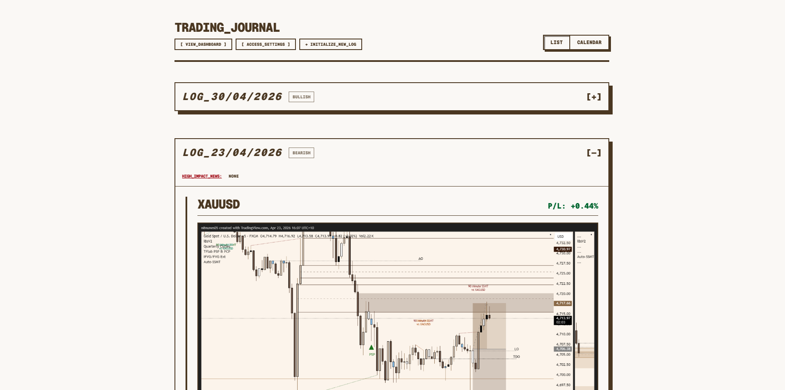
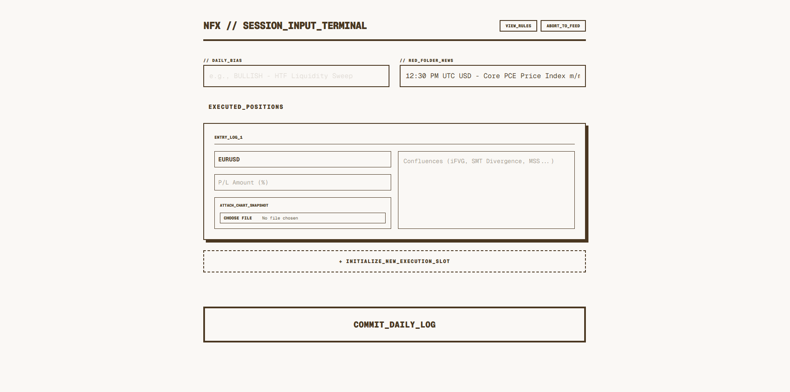
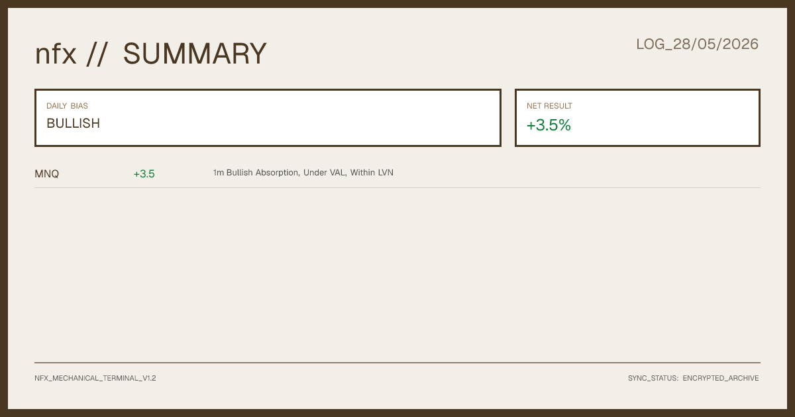

# nfx // Trading Terminal

`nfx` is a high-density, mechanical trading journal and automation terminal built to streamline systemic journaling. Designed with a brutalist, retro-terminal aesthetic, the platform acts as a decentralised "Proof of Work" engine, allowing traders to log daily session context, process execution charts, auto-generate visual summaries, and instantly broadcast metrics to community channels (Discord).

## ⚡ Key Features

* **Mechanical Input Interface:** A rigid, keyboard-centric terminal dashboard optimised for fast data entry under high-friction conditions.
* **Decoupled Media Pipeline:** Automated generation of high-resolution text and data summaries using headless layout rendering.
* **Dossier Engine:** Serverless background compilers that compress complex session metrics, confluences, and execution ledgers into standalone visual data cards.
* **Multi-Channel Broadcasting:** Built-in webhooks that instantly mirror execution archives to external web communication architectures (e.g. Discord servers) upon state confirmation.
* **Secure Auth State Gates:** Granular administrative authentication rules that enforce strict write-privileges across databases and storage buckets.

---

## 📸 Interface Preview

### Administrative Input Node
> The primary dashboard for initialising sessions, defining higher-timeframe biases, listing execution structures, and handling drag-and-drop screenshot arrays.

### Generated Session Card Output
> The pixel-perfect text dossier card dynamically compiled on the server edge, ready for internal feed storage and external broadcasting.

---

## 🛠️ The Architecture Stack

* **Core Framework:** Next.js (App Router)
* **Language Engine:** TypeScript / React
* **Style Sheet Engine:** Tailwind CSS
* **Database & File System:** Firebase Firestore / Cloud Storage
* **Asset Processing:** `@vercel/og` 
* **Integration Network:** Discord Webhook API 

---

## 🧬 Automated Pipeline Lifecycle

1.  **Ingest Stage:** The UI captures higher-timeframe context, macro narratives, and individual trade specifications via custom structured form states.
2.  **Asset Push:** Raw execution screenshots are compiled into safe buffers and uploaded securely to designated storage buckets.
3.  **Compute Phase:** Next.js handlers process incoming telemetry, execute mathematical reductions for net yield calculations, and render a structured typography card inside a serverless layout frame via `@vercel/og`.
4.  **Sync Phase:** The generated high-density card is fetched as a raw data blob and committed directly to the database alongside transaction histories.
5.  **Broadcast Phase:** Webhooks intercept the final commit confirmation and push a formatted payload directly to target server channels.
